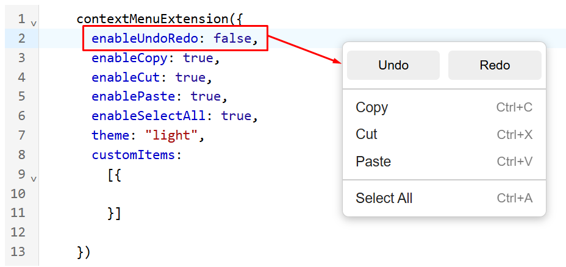

# Context Menu for CodeMirror v6

This package serves the people who need to have a custom and clean context menu.


## Get Started

Install the npm package

```bash
npm install @esbitan/codemirror-context-menu
```

Import project to your main javascript code

```bash
import {contextMenuExtension} from "@esbitan/codemirror-context-menu"
```

Add it to the EXTENSIONS

```bash
extensions: [
    contextMenuExtension({})
    ]
```
## Available variables

There's a good set of variables which allows you to control how the context menu acts
```bash
enableUndoRedo: true, //[true] | [false] | [null]
enableCopy: true,
enableCut: true,
enablePaste: true,
enableSelectAll: true,
theme: "light" //[dark] | [light]
```
## Custom item

You can still add your own items to the context menu and point them to specific functions, as many items as you want.
```bash
customItems:
[{
    label: "Example name",
    shortcut: "Ctrl+Shift+F",
    command: (view) => {
        // user-defined function
        DoSomething();
        }
}]
```

## Table Guide

| Option          | Description                                                                        |
|-----------------|------------------------------------------------------------------------------------|
| enableUndoRedo  | (True / False / Null) Show or hide the HISTORY label, or hide (Undo + Redo) options |
| enableCopy      | (True / False) Show or hide the Copy option                                        |
| enableCut       | (True / False) Show or hide the Cut option                                         |
| enablePaste     | (True / False) Show or hide the Paste option                                       |
| enableSelectAll | (True / False) Show or hide Select All option                                      |
| theme           | (dark / light) can be choosed                                                      |
| customItems     | allows you to add your custom Item, just follow API instructions                  |


***

# Caution
### ⚠️ Clipboard Permissions (Paste)

Browser security restrictions apply when accessing the clipboard.

Copy and Cut will generally work without additional prompts.

Paste, however, may require explicit user approval.

For example, the first time a page tries to read from the clipboard, the browser may show a permission request.

If paste does not work automatically, this is due to browser security policy, not a bug in the extension. Users must allow clipboard access when prompted.

***

## Changelog
#### Version 1.0.2
- New look for Undo/Redo row, the ability to hide the HISTORY label so can have a modern look.
- Fix CSS style bug.
#### Version 1.0.1
- Fix Doubled Separators
- Updates ReadMe Instructions
#### Version 1.0.0
- First Release

---

<p align="center">
  🚀 Made with ❤️ by <a href="https://github.com/Yousefx10">Yousef Hurf</a>
</p>

---
