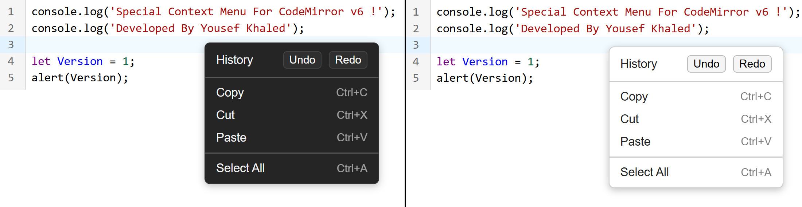

# Context Menu for CodeMirror v6

This package serves the people who need to have a custom and clean context menu.


## Get Started

Install the npm package

```bash
	npm install @esbitan/codemirror-context-menu
```

Import project to your main javascript code

```bash
	import {contextMenuExtension} from "@esbitan/codemirror-context-menu"
```

Add it to the EXTENSIONS

```bash
      extensions: [
        contextMenuExtension({})
      ]
```
## Available variables

There's a good set of variables which allows you to control how the context menu acts
```javascript
    enableUndoRedo: true,
    enableCopy: true,
    enableCut: true,
    enablePaste: true,
    enableSelectAll: true,
    theme: "light" //[dark] / [light]
```
## Custom item

You still can add your own item inside the context menu, and point it to specific function

```bash
  customItems[
    {
        label: "Example name",
        shortcut: "Ctrl+Shift+F",
        command: (view) => {

            // user-defined function
            DoSomething();

        }
    }
  ]
```

## Table Guide

| Option             | Description                                                                |
| ----------------- | ------------------------------------------------------------------ |
| enableUndoRedo |(True / False) Show or hide the HISTORY (Undo + Redo) options |
| enableCopy |(True / False) Show or hide the Copy option |
| enableCut |(True / False) Show or hide the Cut option |
| enablePaste |(True / False) Show or hide the Paste option |
| enableSelectAll |(True / False) Show or hide Select All option |
| theme |(dark / light) can be choosed |
| customItems |allows you to add your custom label, just follow API instructions |


